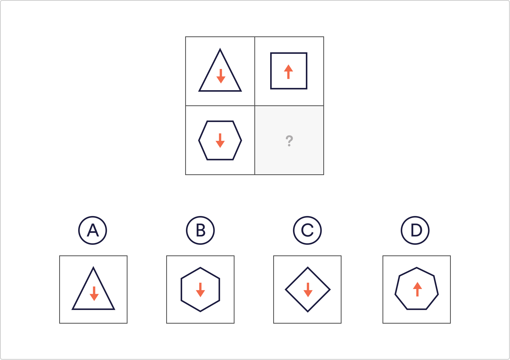

# Abstract Reasoning Q2

Which of the suggested answers best matches the relationship between the shapes in the image?

 A
 B
 C
 `D`

Solution
The arrow changes direction and the shape on the right has 1 more side than its counterpart on the left.

