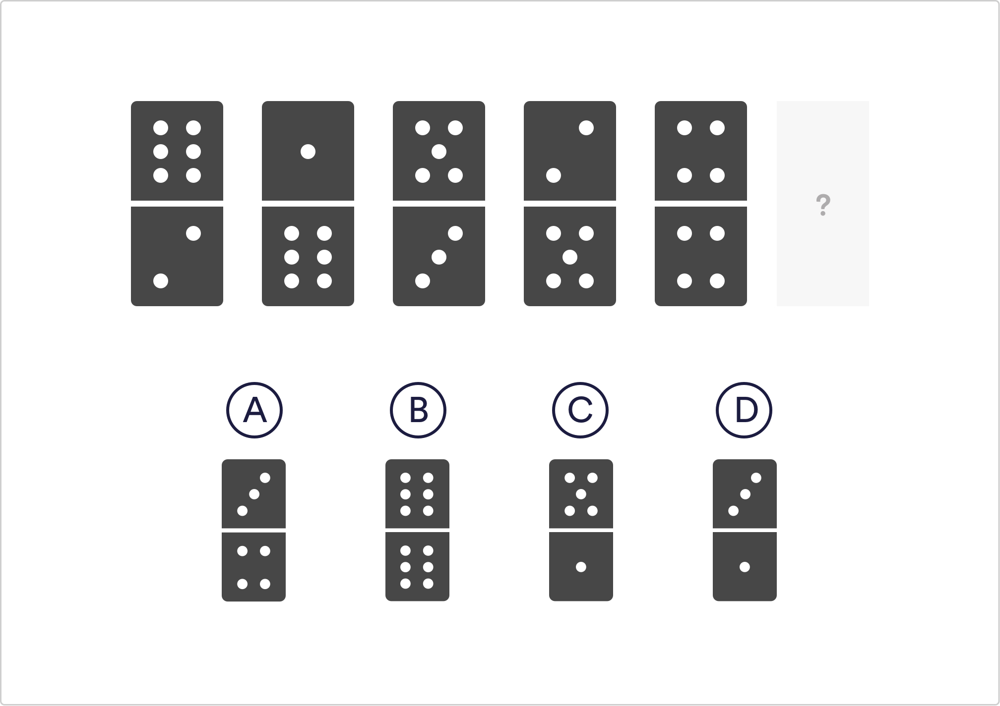

# Abstract Reasoning Q4

Which domino comes next in the sequence?

 `A`
 B
 C
 D

Solution
This question is a bit trickier, as it is asking you to notice that there are two patterns appearing at the same time with alternating dominos. If you consider the 1st, 3rd and 5th dominos, the pattern becomes more obvious.

The top number is decreasing by 1 and the bottom is increasing by 1. Now look at the 2nd and 4th dominos, there is a similar progression happening with increasing and decreasing dots.

