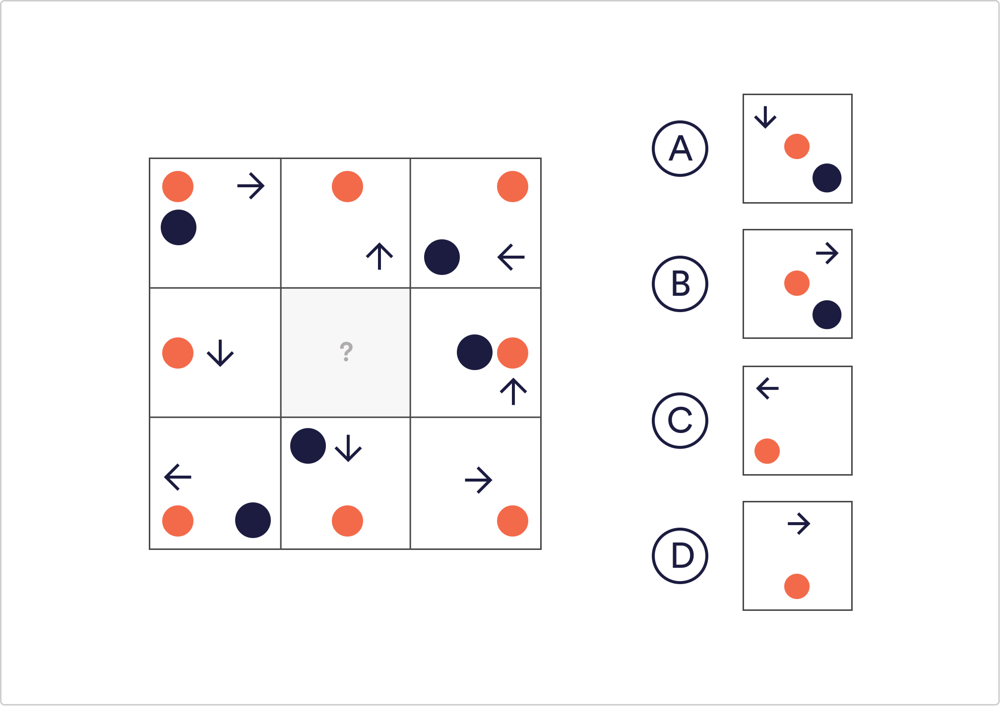

# Abstract Reasoning Q5

Which tile belongs in the blank space?

 A
 `B`
 C
 D

Solution
The position of the orange circle within each tile is relative to the tiles’ position in the wider image. Therefore the circle in the centre tile would be positioned in the middle of the tile. The arrow is also rotating in an anti-clockwise direction as you move from left to right.

