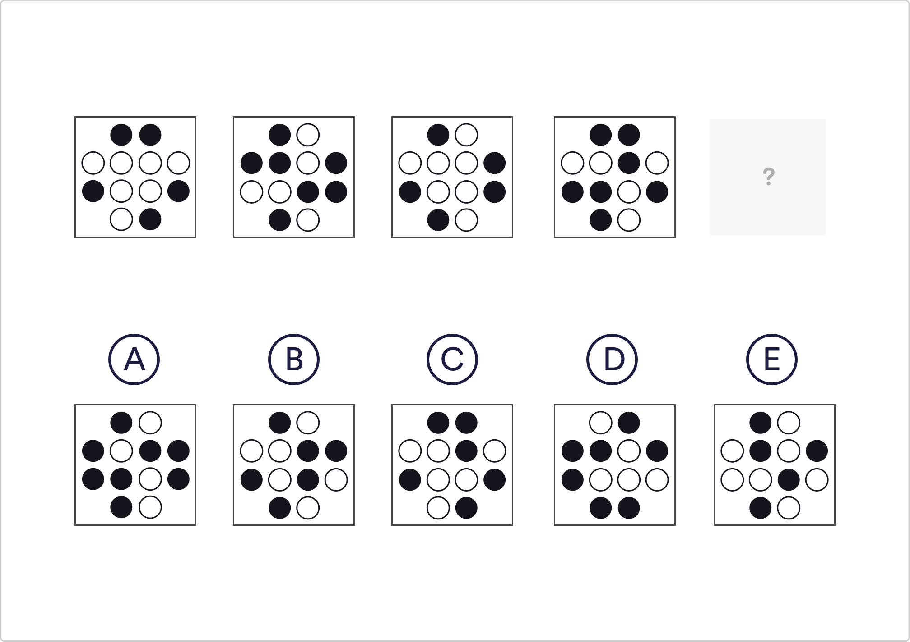

# Abstract Reasoning Q6

Which shape comes next in the sequence?

 A
 B
 C
 D
 `E`

Solution
The black and white dots are alternating between 5 and 7 in number. In the last picture there are 5 white dots and 7 black ones, meaning the following image should contain 7 white dots and 5 black ones.

