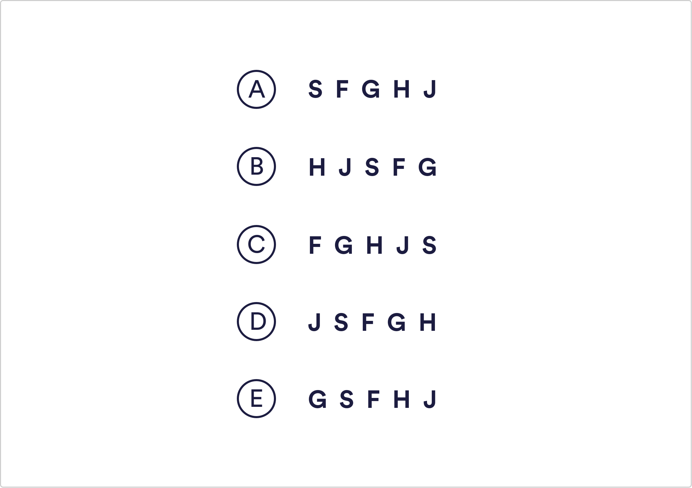

# Abstract Reasoning Q9

Ignoring alphabetical order, which is the odd string of letters out?

 A
 B
 C
 D
 `E`

Solution
Each string of letters contains S, F, G, H and J appearing in a loop. It is easier to imagine if you can see multiple loops appearing consecutively: S-F-G-H-J-S-F-G-H-J-S-F-G-H-J A, B, C and D strings all include letters in the right order to fit in the same loop. For example, F always follows S and precedes G however in the last string (E) The letters are out of order.

