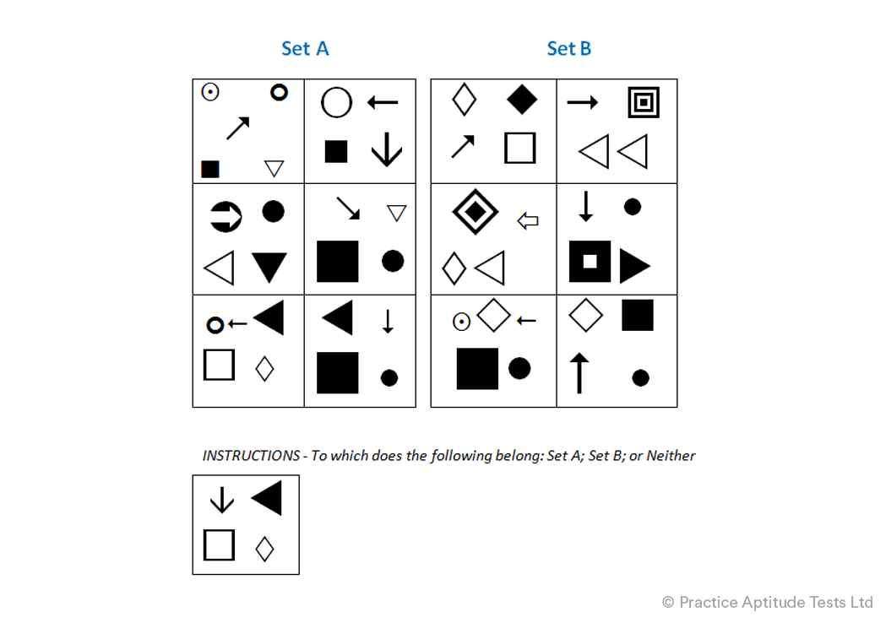

# Diagrammatic Reasoning Q1

Select answer

 Set A
 Set B
 Neither

Solution
The correct answer is Set B because the arrow is pointing to a square. This is the common feature for all six of the Set B blocks. The position, size and colour of each of the blocks doesn’t affect the answer.

Correct Answer; Set B

 
