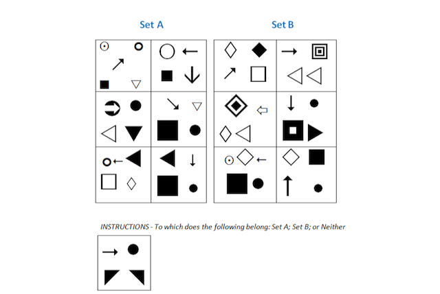

# Diagrammatic Reasoning Q2

Select answer

 Set A
 Set B
 Neither

Solution
The correct answer is Set A because the arrow is pointing to a circle. This is the common feature for all six of the Set A blocks. The position, size and colour of each of the figures doesn’t affect the answer.

Correct Answer; Set A

