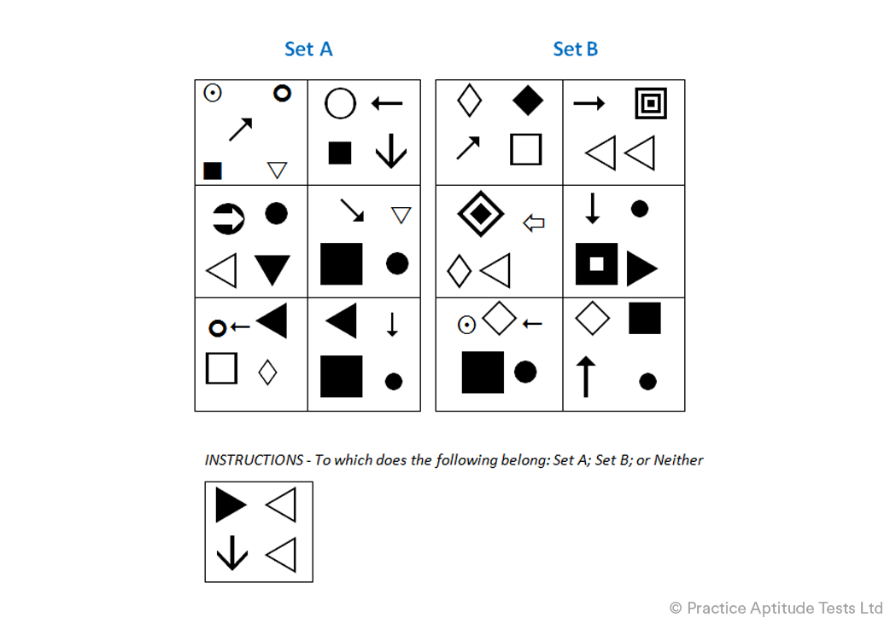

# Diagrammatic Reasoning Q4

Select answer

 Set A
 Set B
 Neither

Solution
The correct answer is Neither since it does not have Set B’s common feature of an arrow pointing to a square, nor does it have Set A’s common feature of an arrow pointing to a circle. In fact, whilst there is an arrow this points away from any of the shapes.

Correct Answer; Neither

