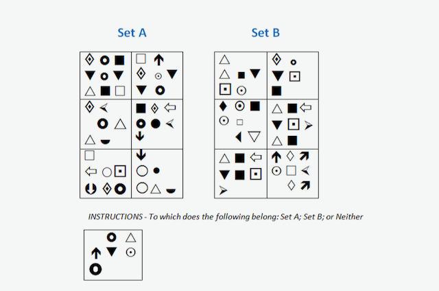

# Diagrammatic Reasoning Q8

Select answer

 Set A
 Set B
 Neither

Solution
Neither, since the central block is a triangle i.e. neither a square (the common feature of all Set B blocks), nor is it a circle (the common feature of all Set A blocks).

Correct Answer; Neither

