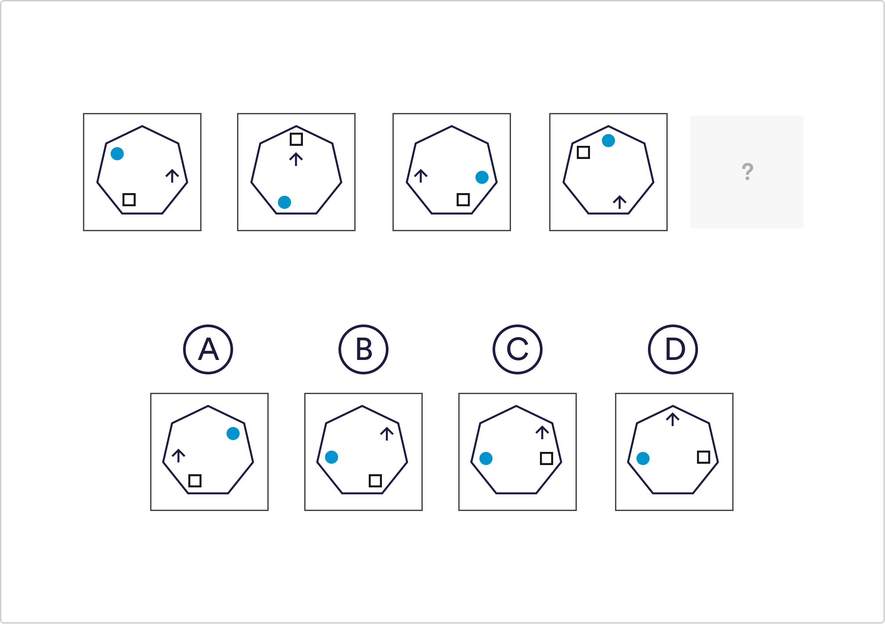

# Logical Reasoning Q1

Which of the given shapes would complete the sequence?

 A
 B
 `C`
 D

Solution
The shapes are moving around the points of the polygon. The circle and arrow are both moving anti-clockwise 2 points, and the square is moving 4 spaces in a clockwise direction.

 
