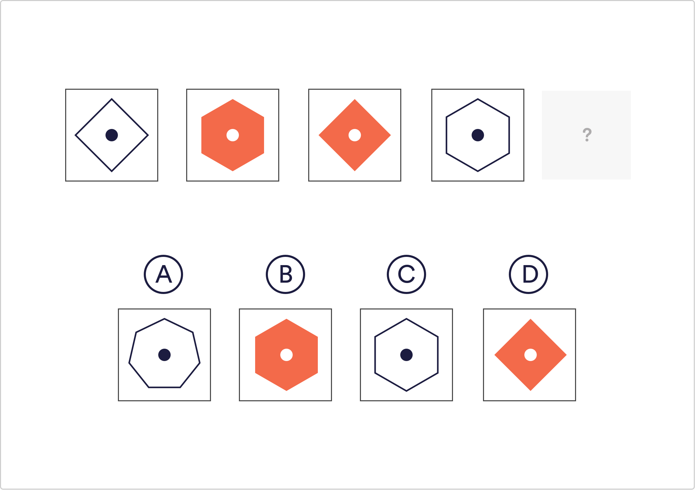

# Logical Reasoning Q2

Which of the given shapes would complete the sequence?

 A
 B
 C
 `D`

Solution
The pattern is alternating between squares and hexagons and both shapes are alternating between coloured and white.

