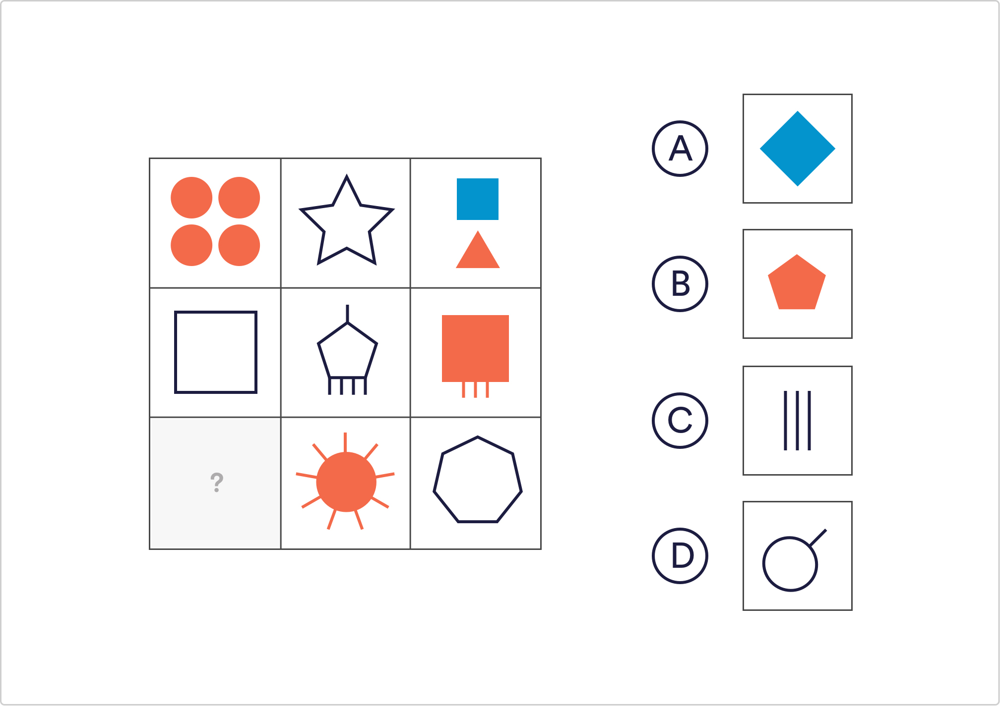

# Logical Reasoning Q3

Which of the given shapes would complete the sequence?

 `A`
 B
 C
 D

Solution
The number of lines featured in each square is related to which column they sit in. The shapes going down the middle column all have 10 lines, the shapes on the right have 7 and the 2 shapes that we can see on the left have 4.

