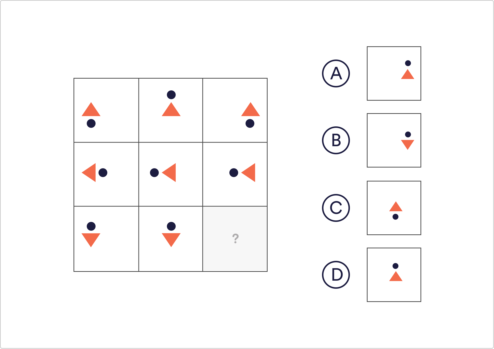

# Logical Reasoning Q4

Which of the given shapes would complete the sequence?

 A
 `B`
 C
 D

Solution
The only shape that is important to note in this example is the orange triangle. It is positioned within its square according to the square’s position in the image. The triangles in the left hand column are positioned to the left, the triangles in the middle column are centred in their corresponding squares and the same for the right hand side.

