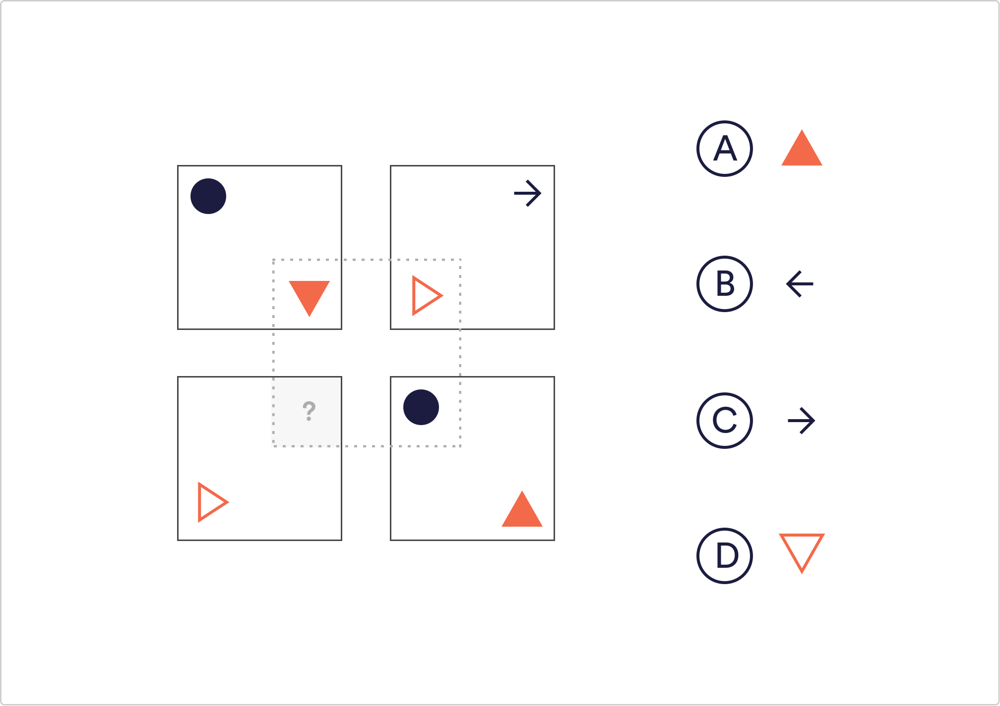

# Logical Reasoning Q6

Which shape would complete the image?

 A
 B
 `C`
 D

Solution
The shapes inside the dotted square correspond to the outer square adjacent to the opposite corner. The shapes change orientation as if they have been reflected in a mirror line separating the top and bottom squares through the middle

