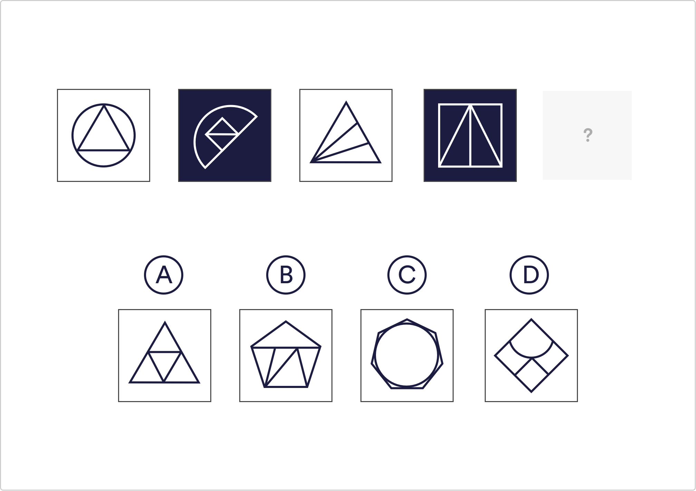

# Logical Reasoning Q7

Which of the given shapes fits the pattern in the sample images?

 A
 `B`
 C
 D

Solution
The sample images are comprised of a larger, outer shape and a number of triangles within the larger shape. The number of triangles within the shape is determined by how many lines make up the outer shape. The circle, with one line, contains one triangle, the square, with four sides, is filled with four triangles. The only given shape that suits this pattern is B, the pentagon is filled with 5 triangles.

