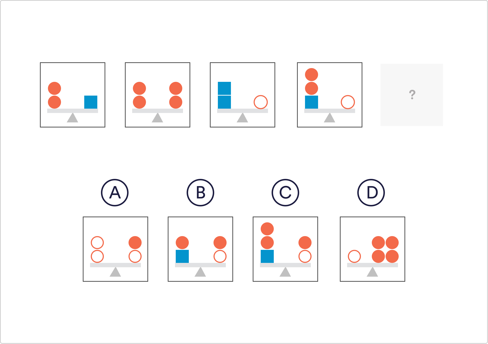

# Logical Reasoning Q8

Which of the given shapes fits the pattern in the sample images?

 A
 B
 C
 `D`

Solution
This question is asking you to identify the relationship between the 3 shapes. The shapes on the left of the scale represent the same value as those shapes on the right. From the first image we can work out the 2 orange circles equate to one blue square. Similarly, two blue squares equate to one white circle. Therefore: 1 white circle = 2 blue squares = 4 orange circles.

