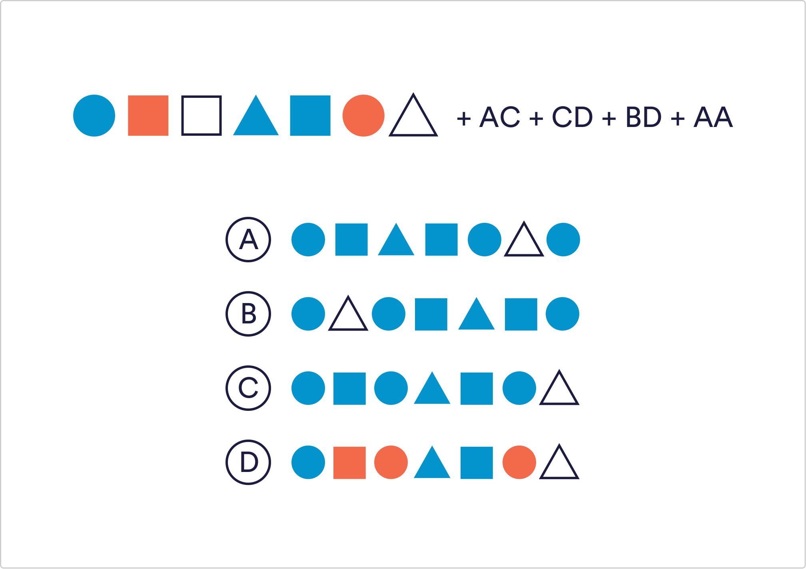

# Logical Reasoning Q9

Question 9

Following the below rules, work out what the new sequence of shapes would look like Rules: AA - Reverse the order of the entire sequence AB - Swap the position of the first and last shape AC - All white squares become orange circles AD - Every shape to the left of a circle is flipped upside down BC - Swap the 2nd and 5th shapes’ positions BD - Move the 3rd shape to the end of the sequence CD - All orange shapes become blue

 A
 `B`
 C
 D

Solution
Follow and apply the rules in the order they are presented. First all the white squares become orange circles. Then, all orange shapes become blue. Then, the third shape needs to be moved to the end. And finally, the sequence should be reversed.

